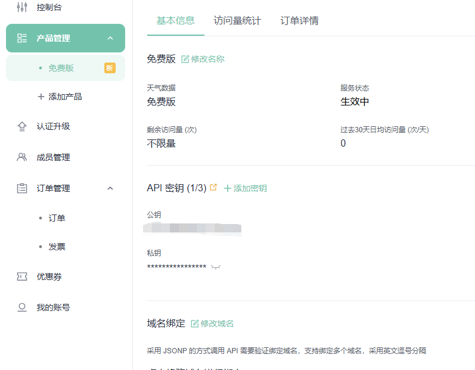
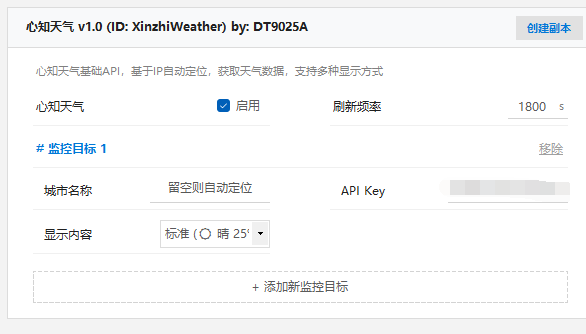

# LiteMonitor-XinzhiWeather

[LiteMonitor](https://github.com/Diorser/LiteMonitor) 的 [心知天气](https://www.seniverse.com/) 插件，基于原版天气插件对心知天气的免费实时天气API做了适配。

## 用法

将 `XinzhiWeather.json` 放至 `resources\plugins` 目录下，重启 LiteMonitor 后进行插件设置。

## 配置

在心知天气中注册账号、申请免费版天气产品：

在 API Key 中填入产品的私钥即可。

